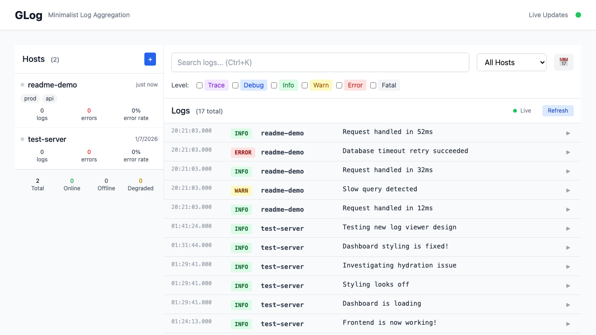

<p align="center">
  
</p>

<p align="center">
  <a href="https://github.com/dotcommander/glog/releases"></a>
  <a href="https://github.com/dotcommander/glog/actions/workflows/release.yml"></a>
  <a href="https://github.com/dotcommander/glog/blob/main/go.mod"></a>
  <a href="https://github.com/dotcommander/glog/blob/main/LICENSE"></a>
</p>

---

You could spin up Elasticsearch, Logstash, and Kibana. Configure a Loki cluster. Pay Datadog per gigabyte. Set up Fluentd with seventeen plugins.

Or: run one binary. Ship logs. Watch them arrive.

GLog is self-hosted log aggregation that runs on SQLite and ships as a single binary. No cloud accounts, no YAML rituals, no distributed systems degree required.



## 30-second demo

```bash
# Install
curl -sL https://github.com/dotcommander/glog/releases/latest/download/glog-$(uname -s)-$(uname -m) -o glog
chmod +x glog

# Start the server (database creates itself)
./glog serve

# In another terminal: register a host, get an API key
./glog host register --server http://localhost:6016 --name my-server
# Writes config to ./glog.json — no manual setup

# Ship a log
./glog log "Deployment complete" --level info --field version=2.1.0

# Pipe anything
tail -f /var/log/syslog | ./glog log --stream --level info
```

Server opens at `http://localhost:6016`. Dashboard and API, same port.

## Install

**Binary** (recommended):

Grab the latest from the [releases page](https://github.com/dotcommander/glog/releases). macOS and Linux, amd64 and arm64.

**Go install**:

```bash
go install github.com/dotcommander/glog/cmd/glog@latest
```

**From source**:

```bash
git clone https://github.com/dotcommander/glog && cd glog
make          # Builds frontend + backend, starts on :6016
make install  # Puts glog in ~/go/bin
```

## CLI

```bash
glog serve                              # Start server (:6016 by default)
glog serve --addr :8080 --db logs.db    # Custom port and database path

glog host register --name prod-api      # Register host, saves config to ./glog.json
glog host list                          # Show registered hosts

glog log "Something happened"           # Send a log (level: info)
glog log --level error "Disk full"      # Explicit level
glog log --field region=us-east-1 "OK"  # Attach structured fields

journalctl -f | glog log --stream       # Stream stdin, batched at 100 lines
cat app.log | glog log --level warn     # Pipe a file

glog migrate --db glog.db               # Run database migrations
glog version                            # Print version and build time
```

Configuration resolves in order: flags, then `GLOG_SERVER`/`GLOG_API_KEY` env vars, then `./glog.json`.

## API

### Hosts

| Method | Path | Auth | |
|--------|------|------|-|
| POST | `/api/v1/hosts` | - | Register host, returns API key |
| GET | `/api/v1/hosts` | - | List all hosts |
| GET | `/api/v1/hosts/{id}` | - | Get host details |
| GET | `/api/v1/hosts/{id}/stats` | - | Host log statistics |

### Logs

| Method | Path | Auth | |
|--------|------|------|-|
| POST | `/api/v1/logs` | Bearer | Create log entry |
| POST | `/api/v1/logs/bulk` | Bearer | Bulk create (up to 1000) |
| GET | `/api/v1/logs` | - | Query with filters |
| GET | `/api/v1/logs/{id}` | - | Get single log |

### Stream & Export

| Method | Path | Auth | |
|--------|------|------|-|
| GET | `/api/v1/events` | - | SSE live stream |
| GET | `/api/v1/export/{json,csv,ndjson}` | Bearer | Export logs |
| GET | `/health` | - | Health check |

Auth means `Authorization: Bearer glog_v1_<key>` — the key you get from `host register`.

```bash
# Create a log via curl
curl -X POST http://localhost:6016/api/v1/logs \
  -H "Authorization: Bearer glog_v1_<key>" \
  -H "Content-Type: application/json" \
  -d '{"level":"error","message":"Payment failed","fields":{"order_id":"abc123"}}'

# Stream live events
curl -N http://localhost:6016/api/v1/events
```

## Under the hood

Go backend. Svelte 5 frontend. SQLite in WAL mode. Everything compiles to one binary.

```
┌─────────────────────────────────────────────────┐
│  CLI (cobra)          Browser (Svelte 5)        │
│  glog log/host/serve  localhost:6016            │
└──────────┬────────────────────┬─────────────────┘
           │                    │
     ┌─────▼────────────────────▼─────┐
     │       HTTP / SSE (chi/v5)      │
     │  handlers → repos (no service  │
     │  layer, no ceremony)           │
     └──────────────┬─────────────────┘
                    │
          ┌─────────▼─────────┐
          │   SQLite (WAL)    │
          │   single file     │
          │   embedded migrations │
          └───────────────────┘
```

Handlers call repositories directly. The domain layer defines entities and interfaces — no infrastructure imports. Swapping SQLite for PostgreSQL means writing new repository implementations. Nothing else changes.

```
cmd/glog/           CLI and server entry point
internal/
  domain/           Entities, repository interfaces, pattern matching
  infrastructure/   HTTP handlers, SQLite repos, SSE hub
web/                Svelte 5 frontend (built into web/build/)
```

## Philosophy

Small tools that do one thing well. Your logs belong on your hardware. The database is a single file you can `cp` to back up. The server is a single binary you can `scp` to deploy.

No agents. No sidecars. No config management. Start the binary, point your apps at it, read your logs.

## Why not X?

| Tool | What you get | What it costs |
|------|-------------|---------------|
| ELK Stack | Full-text search, Kibana | JVM heap tuning, three services, YAML therapy |
| Loki + Grafana | Label-based queries | Promtail sidecar, chunk storage, LogQL |
| Datadog / Splunk | Everything, managed | Per-GB pricing, vendor lock-in |
| Papertrail | Hosted, simple | Monthly bill, data leaves your network |
| **GLog** | Dashboard, SSE, structured fields | One binary, SQLite, done |

GLog is for teams who want log aggregation without the infrastructure tax. If you need petabyte-scale search across a fleet of thousands, use the big tools. If you have a handful of servers and want to see what's happening right now — this is the one.

## Docs

- [Go integration](docs/go-integration.md) — embed glog in your Go services
- [Deployment](docs/guides/deployment.md) — Docker, systemd, nginx
- [SSE events](docs/api/events.md) — real-time event format
- [Architecture](docs/architecture/README.md) — design decisions
- [Contributing](docs/contributing.md) — commit format, test requirements

## License

MIT. Because logs shouldn't require permission.
